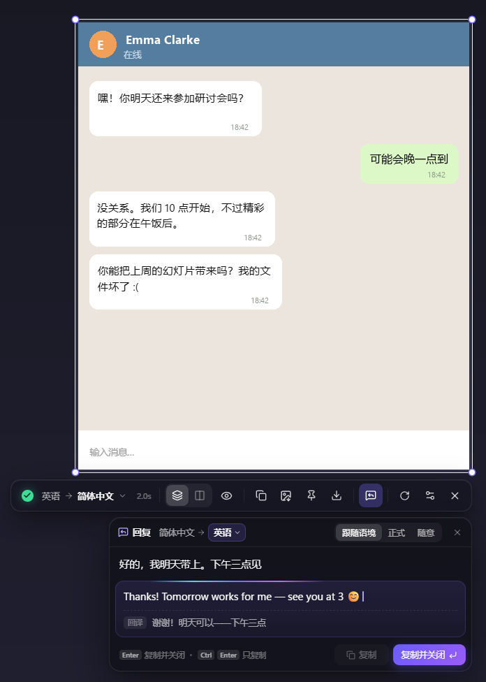
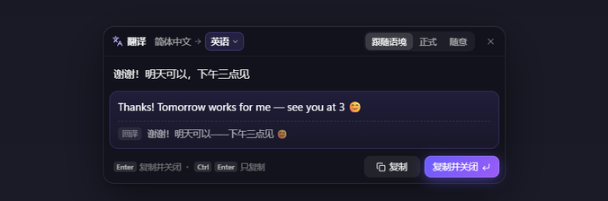
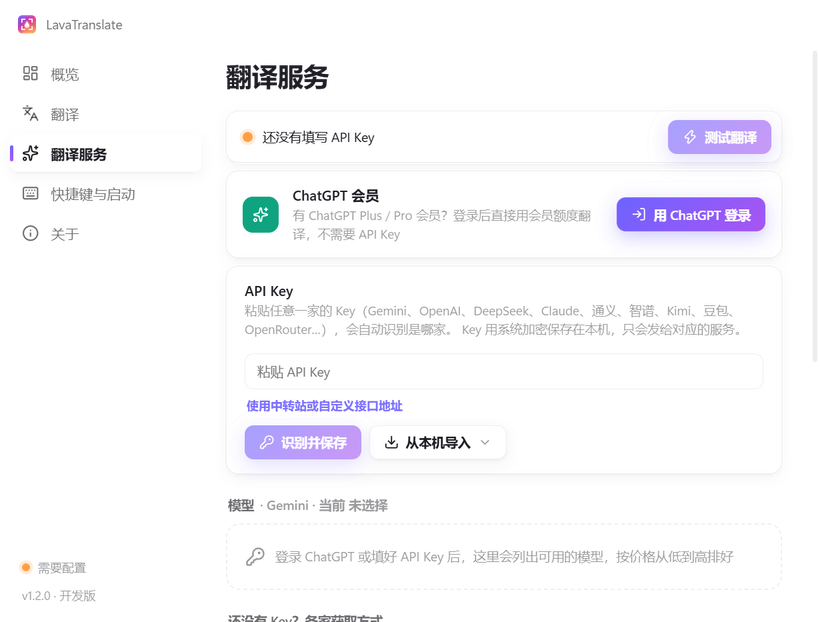

<p align="center">
  
</p>

<h1 align="center">LavaTranslate</h1>

<p align="center">
  <b>Select any part of your screen — the translation appears right on top of it, in the same layout.</b><br>
  Then answer foreign-language chats in your own language.
</p>

<p align="center">
  <a href="https://github.com/chengcczzjj/LavaTranslate/releases/latest"></a>
  
  <a href="https://github.com/chengcczzjj/LavaTranslate/releases"></a>
</p>

<p align="center"><b>English</b> · <a href="README.zh-CN.md">简体中文</a></p>

---


## Why LavaTranslate

Most screenshot translators show a list of sentences in a separate window, so you have to match each one back to the screen. LavaTranslate puts every translated line **exactly where the original was**:

- **Same position, size, color, weight and alignment.** Each line keeps its font size (measured from the actual stroke height), text color (robust to ClearType fringes), bold or regular weight, and left/center/right alignment. Paragraphs that wrap around images keep their shape.
- **Icons stay visible.** Arrows, stars, list numbers and other icons that OCR mistakes for letters are not painted over.
- **The model looks at the screenshot itself.** OCR runs locally; a vision model then fixes recognition errors, merges wrapped lines into paragraphs, and leaves code, commands, URLs, @handles and brand names untranslated.
- **Fast.** The capture overlay appears in about 0.2 s, local OCR takes 0.1–0.3 s on the GPU, and translations stream in block by block. A small model finishes a typical screenshot in 2–5 s.


## Reply assistant

You can read the other person's message now — LavaTranslate also helps you answer it.



- When the screenshot is a **chat, DM, comment thread or email**, a reply box opens under the toolbar after the translation finishes. Press <kbd>R</kbd> to open it anytime.
- Type in your own language. It starts translating after a short pause, into the language detected on screen (you can change it).
- Pick a tone: **Match the conversation**, **Formal** or **Casual**. The model reads the conversation on screen to get the wording and form of address right.
- A **back-translation** below the result shows you what you are actually sending.
- <kbd>Enter</kbd> copies and closes so you can paste straight into the chat. <kbd>Ctrl</kbd>+<kbd>Enter</kbd> copies only, <kbd>Shift</kbd>+<kbd>Enter</kbd> adds a new line, and <kbd>↑</kbd>/<kbd>↓</kbd> go through your previous replies.

<br clear="right">

## Type to translate

Press the hotkey **twice** (<kbd>Alt</kbd>+<kbd>Q</kbd> <kbd>Q</kbd>) to skip the screenshot and just type. LavaTranslate waits until you pause (about 1.4 s, or press <kbd>Enter</kbd>), then translates into the language you last translated a reply into. If what you typed is already in that language, it translates it into yours instead. <kbd>Enter</kbd> copies and closes.



## Download and install

1. Download **`LavaTranslate-Setup-x.y.z.exe`** from [Releases](https://github.com/chengcczzjj/LavaTranslate/releases/latest). It runs on Windows 10/11 x64.
2. Run the installer. If Windows SmartScreen warns about an unknown publisher, click **More info → Run anyway**.
3. LavaTranslate runs in the system tray. Updates are downloaded automatically in the background (see [Updates](#updates)).

> The interface is currently in Simplified Chinese. You can translate between any languages the model supports.

## Android

Download **`LavaTranslate-Android-x.y.z.apk`** from [Releases](https://github.com/chengcczzjj/LavaTranslate/releases/latest) (Android 10 or later, arm64). Open it and follow the on-screen steps to turn on the floating button and add an API key.

- **Translate the whole screen.** Tap the floating button in any app and the translation appears in place over the original. **Tap the button again or press Back to exit**; **long-press** it for the menu (show original, change language, copy, retranslate, reply).
- **Reply assistant.** Chat screenshots get a Reply button: write in your own language and get it in theirs, with a back-translation. When you're not translating, long-press the floating button and pick "Quick reply" (the bottom item) to type something to translate.
- **Two ways to capture the screen:** Android's screen-sharing permission (it has to be granted again after the phone is locked — an Android rule), or turn on "免授权截屏" once under Accessibility and it stays on.
- Text recognition runs on the phone; only the captured screen goes to the translation service you configured.
- **Easy on the battery.** While you're not using it, the floating button doesn't capture the screen or touch the network, and its interface is paused. Long-press it and pick "Exit" to quit completely; it also exits on its own after a period of disuse (1 hour by default) or when Battery Saver turns on, and a tap on the notification brings it back.
- **In-app updates.** New versions are announced in the app, downloaded on Wi-Fi, and installed with one tap.

## Setup: sign in with ChatGPT, or bring any API key

LavaTranslate does not ship with a key. Open **Settings** (double-click the tray icon) → **翻译服务 (Translation service)**:

- **ChatGPT Plus / Pro** — click **用 ChatGPT 登录 (Sign in with ChatGPT)**. Translations use your plan's usage instead of an API key. This is OpenAI's official "use your ChatGPT plan" sign-in for open-source apps.
- **Any API key** — paste it and click **识别并保存 (Detect & save)**. LavaTranslate recognizes the provider from the key's format (`AIza…` Gemini, `sk-ant-…` Claude, `sk-or-…` OpenRouter, `sk-proj-…` OpenAI, Zhipu and Doubao formats), or by trying it against DeepSeek, OpenAI, Qwen and Kimi. If it still can't tell, it asks you to pick. For relays and local servers, also fill in the endpoint URL.

Then pick a model (sorted by estimated cost per 1,000 screenshots) and click **测试翻译 (Test)**. Every key you add is kept, and the saved services appear as chips you can switch between. Each provider has step-by-step instructions and a link to its key page at the bottom of the page.



**Providers**

| Provider | Get a key | Good fast models | Notes |
| --- | --- | --- | --- |
| ChatGPT Plus / Pro | Sign in — no key | `gpt-6-luna` | Uses your plan's usage. |
| Gemini | [Google AI Studio](https://aistudio.google.com/apikey) | `gemini-3.5-flash-lite` | Free tier; free-tier data may be used by Google. Needs a proxy in mainland China. |
| OpenAI | [OpenAI Platform](https://platform.openai.com/api-keys) | `gpt-6-luna`, `gpt-5-mini` | ChatGPT plans don't include API credit. |
| DeepSeek | [DeepSeek Platform](https://platform.deepseek.com/api_keys) | `deepseek-flash` | Reads images, ~1 s to first token, half price off-peak. |
| Qwen (Alibaba Cloud) | [Model Studio](https://bailian.console.aliyun.com/?tab=model#/api-key) | `qwen3.8-flash` | Free quota for new users. |
| Zhipu GLM | [BigModel](https://bigmodel.cn/usercenter/proj-mgmt/apikeys) | `glm-4.6v-flash` | Free vision model (one request at a time). |
| Kimi | [Kimi Platform](https://platform.kimi.com/console/api-keys) | | |
| Doubao (Volcano Engine) | [Ark console](https://console.volcengine.com/ark/region:ark+cn-beijing/apiKey) | `doubao-seed-2.0-mini` | Free quota for new users. |
| Claude | [Claude Console](https://platform.claude.com/settings/keys) | `claude-haiku-4-5` | API key only — Anthropic doesn't allow third-party apps to use Claude Pro/Max logins. Called through Anthropic's OpenAI-compatible endpoint. |
| OpenRouter | [OpenRouter](https://openrouter.ai/settings/keys) | | One key for many vendors. |
| Custom | — | | Any OpenAI-compatible endpoint: relays, Ollama, LM Studio… |

LavaTranslate asks every model to skip "thinking" (each provider's own switch, falling back automatically), which makes translation 2–4× faster on models such as DeepSeek V4 Flash and GLM Flash. Models without image input still work: they translate from the OCR text alone, so they can't correct OCR mistakes. On the Custom provider, **从本机导入 (Import from this PC)** can fill in a key from Codex or CC Switch.

## Shortcuts

| Key | Action |
| --- | --- |
| <kbd>Alt</kbd>+<kbd>Q</kbd> (configurable) or click the tray icon | Start a capture |
| Press the hotkey twice | Type a sentence to translate |
| Double-click the tray icon | Open Settings |
| Drag / click | Select a region / select the window under the cursor |
| Drag the selection or its handles | Move / resize — it translates again when you let go |
| Hold <kbd>Alt</kbd> | The overlay steps aside so you can click and scroll the apps underneath; let go to capture again (an existing selection is re-translated if its content changed) |
| Hold <kbd>Space</kbd> | Show the original |
| <kbd>Tab</kbd> | Switch between *in place* and *side by side* |
| Click a translated block | Copy that block |
| <kbd>Ctrl</kbd>+<kbd>C</kbd> / <kbd>Alt</kbd>+<kbd>C</kbd> | Copy all translations / all original text |
| <kbd>Ctrl</kbd>+<kbd>Shift</kbd>+<kbd>C</kbd> / <kbd>Ctrl</kbd>+<kbd>S</kbd> | Copy / save the translated screenshot |
| <kbd>F3</kbd> | Pin the result on the desktop (drag to move, scroll to zoom, double-click to close) |
| <kbd>R</kbd> | Open the reply assistant |
| <kbd>Enter</kbd> or double-click | Copy all translations and close |
| Right-click or <kbd>Esc</kbd> | Exit |

## Privacy

- Text recognition (OCR) runs **locally** on your PC.
- Only the region you select (image + recognized text), plus any reply you type, is sent to **the service you configured**. Nothing goes to us. LavaTranslate keeps no history.
- Your API keys and ChatGPT sign-in tokens are encrypted with Windows DPAPI and stay on your PC. The settings page only ever shows its last 4 characters.

## Updates

- LavaTranslate checks this repository's Releases **20 seconds after it starts and then every 4 hours**. You can also check any time: tray menu → **检查更新 (Check for updates)**, or Settings → **关于 (About)** → **检查更新**.
- A new version downloads in the background. Only the parts of the installer that changed are downloaded.
- When it's ready you get a notification, and **重启并更新到 vX (Restart & update)** appears in the tray menu and on the About page. If you don't restart, it installs the next time you quit.
- The version and update status are also shown at the bottom of the Settings sidebar; click them to open the About page. Turn automatic updates off in Settings → 关于.

## FAQ

**Can I use my ChatGPT / Codex subscription?**
Yes, with ChatGPT Plus or Pro: Settings → 翻译服务 → **用 ChatGPT 登录**. Translations count against your plan's usage. Claude Pro/Max can't be used this way — Anthropic doesn't allow third-party apps to use claude.ai logins — so Claude needs an API key.

**The translation is slow.**
Choose a smaller model (marked 快 / fast). Reasoning-heavy models spend seconds thinking before they write.

**Which languages are supported?**
The local OCR reads Chinese, Japanese, English and other Latin-script languages, Cyrillic and more. A vision model reads anything the OCR can't (for example Korean) straight from the screenshot. You can translate into any language you pick on the toolbar.

**How do I uninstall?**
Go to Windows Settings → Apps → LavaTranslate → Uninstall.

## Build from source

Requirements: Windows 10/11 x64, Node.js 22+, and Python 3 with `onnx` (optional, used to patch the OCR model for speed).

```bash
npm install
npm run models   # download the PP-OCRv6 models (~30 MB)
npm run dev      # run in development mode
npm run dist     # build the NSIS installer into dist/
```

Architecture, the layout engine and the test harnesses are described in [docs/DEVELOPMENT.md](docs/DEVELOPMENT.md) (Chinese).

Built with Electron, React, Motion, [PaddleOCR PP-OCRv6](https://github.com/PaddlePaddle/PaddleOCR) models run by ONNX Runtime (DirectML), and the OpenAI / Anthropic SDKs.

## License

[MIT](LICENSE) © 2026 chengcczzjj

---

<p align="center">Bug reports and ideas: <a href="https://github.com/chengcczzjj/LavaTranslate/issues">Issues</a></p>
