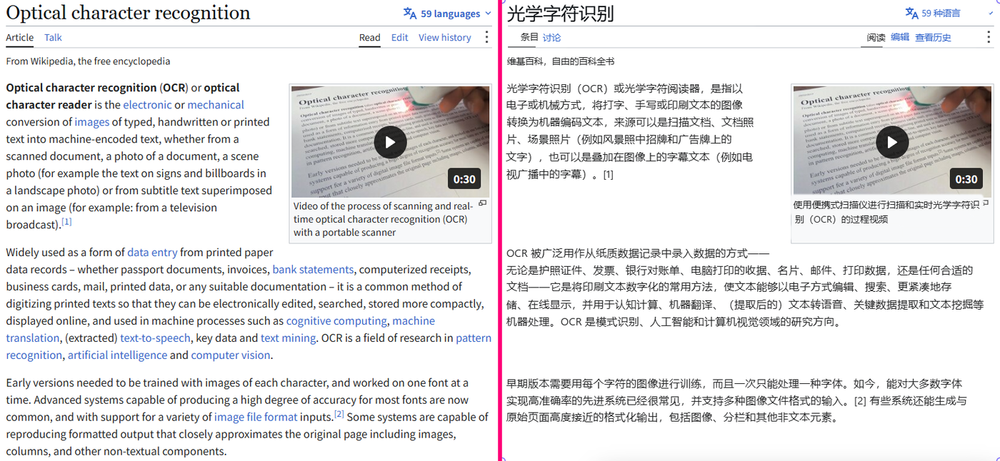
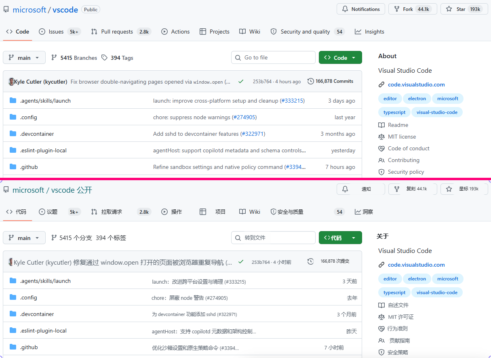
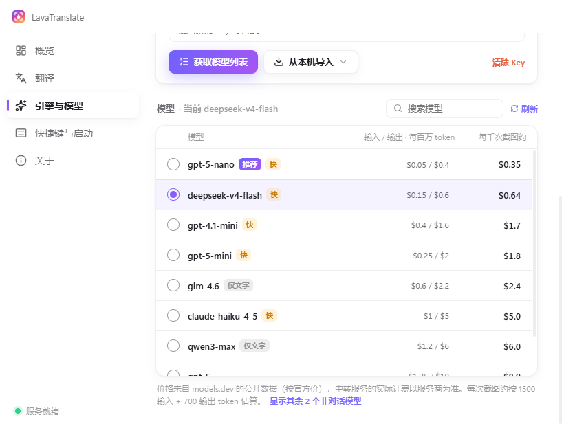

  

<h1 align="center">LavaTranslate</h1>

  <b>Select any part of your screen — the translation appears right on top of it, in the same layout.</b> 
  Then answer foreign-language chats in your own language.

  
  
  

<b>English</b> · <a href="README.zh-CN.md">简体中文</a>

---

## Why LavaTranslate

Most screenshot translators show a list of sentences in a separate window, so you have to match each one back to the screen. LavaTranslate puts every translated line **exactly where the original was**:

- **Same position, size, color, weight and alignment.** Each line keeps its font size (measured from the actual stroke height), text color (robust to ClearType fringes), bold or regular weight, and left/center/right alignment. Paragraphs that wrap around images keep their shape.
- **Icons stay visible.** Arrows, stars, list numbers and other icons that OCR mistakes for letters are not painted over.
- **The model looks at the screenshot itself.** OCR runs locally; a vision model then fixes recognition errors, merges wrapped lines into paragraphs, and leaves code, commands, URLs, @handles and brand names untranslated.
- **Fast.** The capture overlay appears in about 0.2 s, local OCR takes 0.1–0.3 s on the GPU, and translations stream in block by block. A small model finishes a typical screenshot in 2–5 s.

## Reply assistant

You can read the other person's message now — LavaTranslate also helps you answer it.

- When the screenshot is a **chat, DM, comment thread or email**, a reply box opens under the toolbar after the translation finishes. Press <kbd>R</kbd> to open it anytime.
- Type in your own language. It starts translating after a short pause, into the language detected on screen (you can change it).
- Pick a tone: **Match the conversation**, **Formal** or **Casual**. The model reads the conversation on screen to get the wording and form of address right.
- A **back-translation** below the result shows you what you are actually sending.
- <kbd>Enter</kbd> copies and closes so you can paste straight into the chat. <kbd>Ctrl</kbd>+<kbd>Enter</kbd> copies only, <kbd>Shift</kbd>+<kbd>Enter</kbd> adds a new line, and <kbd>↑</kbd>/<kbd>↓</kbd> go through your previous replies.

 

## Download and install

1. Download **`LavaTranslate-Setup-x.y.z.exe`** from [Releases](https://github.com/chengcczzjj/LavaTranslate/releases/latest). It runs on Windows 10/11 x64.
2. Run the installer. If Windows SmartScreen warns about an unknown publisher, click **More info → Run anyway**.
3. LavaTranslate runs in the system tray. Updates are downloaded automatically in the background (see [Updates](#updates)).

> The interface is currently in Simplified Chinese. You can translate between any languages the model supports.

## Setup: bring your own API key

LavaTranslate does not ship with a key. You use your own, and you only pay your provider for what you translate.

1. Open **Settings** (tray icon → 设置) → **引擎与模型 (Engine & model)** → **OpenAI 兼容 (OpenAI-compatible)**.
2. Enter the **API base URL** (leave it empty for OpenAI) and your **API key**, then click **获取模型列表 (Fetch models)**.
3. Pick a model. The list is sorted by estimated cost per 1,000 screenshots and marks the recommended, fast, and text-only models. Small vision models such as `gpt-5-nano`, `gpt-5-mini` or `deepseek-v4-flash` are quick and cost well under **$1 per 1,000 screenshots**.
4. Click **测试翻译 (Test)**, then press <kbd>Alt</kbd>+<kbd>Q</kbd> anywhere and drag over some text.

**Supported services**

| Service | Notes |
| --- | --- |
| OpenAI | Responses API, with the lowest reasoning effort the model allows. |
| OpenAI-compatible relays, OpenRouter | Any base URL ending in `/v1`. |
| DeepSeek, Qwen, GLM, Moonshot and other official APIs | Detected automatically and switched to Chat Completions. |
| Local servers (Ollama, LM Studio…) | Use their OpenAI-compatible endpoint. |
| Claude | Anthropic API key, or the Claude Code login on this PC (personal use). |

Models without image input still work. They translate from the OCR text alone, so they can't correct OCR mistakes.

If Codex or CC Switch is installed, **从本机导入 (Import from this PC)** fills in an existing key for you.

## Shortcuts

| Key | Action |
| --- | --- |
| <kbd>Alt</kbd>+<kbd>Q</kbd> (configurable) | Start a capture |
| Drag / click | Select a region / select the window under the cursor |
| Drag the selection or its handles | Move / resize — it translates again when you let go |
| Hold <kbd>Space</kbd> | Show the original |
| <kbd>Tab</kbd> | Switch between *in place* and *side by side* |
| Click a translated block | Copy that block |
| <kbd>Ctrl</kbd>+<kbd>C</kbd> / <kbd>Alt</kbd>+<kbd>C</kbd> | Copy all translations / all original text |
| <kbd>Ctrl</kbd>+<kbd>Shift</kbd>+<kbd>C</kbd> / <kbd>Ctrl</kbd>+<kbd>S</kbd> | Copy / save the translated screenshot |
| <kbd>F3</kbd> | Pin the result on the desktop (drag to move, scroll to zoom, double-click to close) |
| <kbd>R</kbd> | Open the reply assistant |
| <kbd>Enter</kbd> or double-click | Copy all translations and close |
| Right-click / <kbd>Esc</kbd> | Select again / exit |

## Privacy

- Text recognition (OCR) runs **locally** on your PC.
- Only the region you select (image + recognized text), plus any reply you type, is sent to **the service you configured**. Nothing goes to us. LavaTranslate keeps no history.
- Your API key is encrypted with Windows DPAPI and stays on your PC. The settings page only ever shows its last 4 characters.

## Updates

LavaTranslate checks this repository's Releases every 4 hours and downloads only the parts of the installer that changed. When an update is ready, **重启并更新 (Restart & update)** appears in the tray menu and on the About page. If you don't restart, it installs the next time you quit. You can turn this off in Settings → 关于 (About).

## FAQ

**Can I use my ChatGPT / Codex subscription?**
No. A ChatGPT login doesn't come with an API key. You need an API key from OpenAI or another provider.

**The translation is slow.**
Choose a smaller model (marked 快 / fast). Reasoning-heavy models spend seconds thinking before they write.

**Which languages are supported?**
The local OCR reads Chinese, Japanese, English and other Latin-script languages, Cyrillic and more. A vision model reads anything the OCR can't (for example Korean) straight from the screenshot. You can translate into any language you pick on the toolbar.

**How do I uninstall?**
Go to Windows Settings → Apps → LavaTranslate → Uninstall.

---

© 2026 chengcczzjj · Bug reports and ideas: <a href="https://github.com/chengcczzjj/LavaTranslate/issues">Issues</a>

